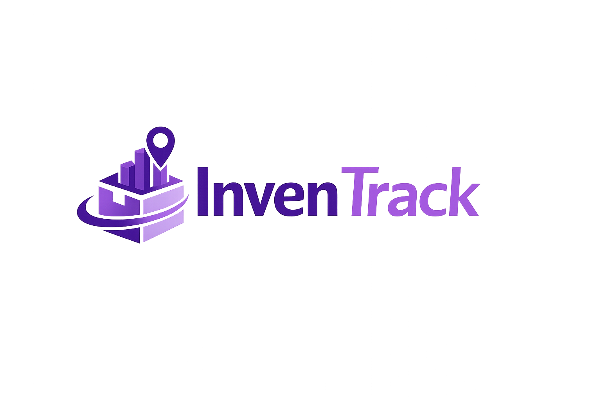
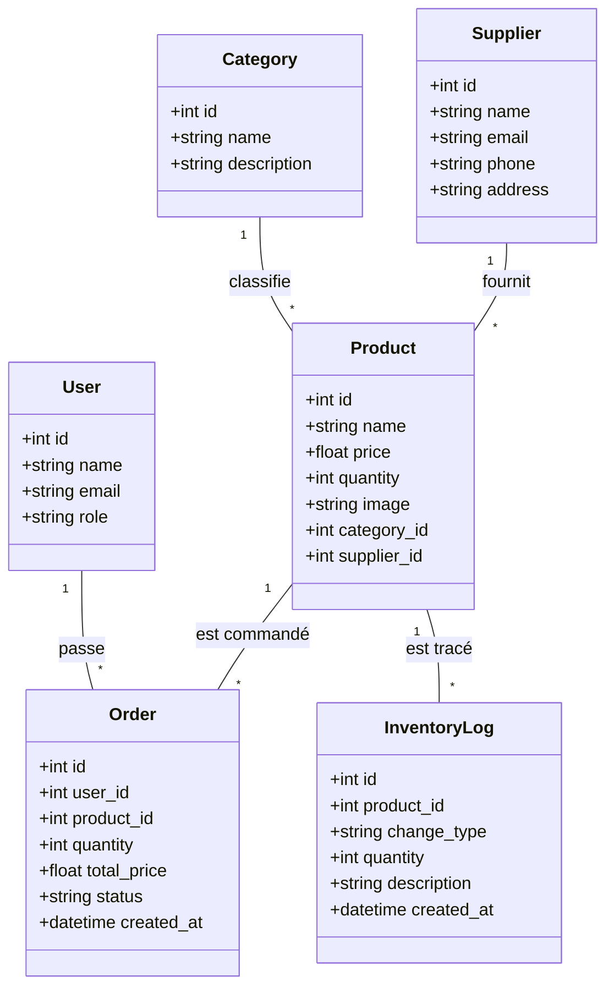

  
  <h1>📦 InvenTrack - Système de Gestion d'Inventaire Premium</h1>
  
Une solution full-stack complète pour la gestion de stocks, commandes et analytiques.

---

## 🚀 Présentation

**InvenTrack** est une application moderne conçue pour simplifier la gestion des stocks. Elle offre une interface élégante en mode sombre (Glassmorphism) et une architecture robuste basée sur Laravel et React.

---

## 📊 Diagramme de Classe (Architecture des Données)

---

## 📡 Routes & Fonctionnalités

### 🖥️ Frontend (React)

| Route         | Description                                 | Accès             |
| :------------ | :------------------------------------------ | :---------------- |
| `/`           | Tableau de bord (Statistiques & Graphiques) | Tous              |
| `/login`      | Connexion à l'application                   | Public            |
| `/register`   | Création de compte                          | Public            |
| `/products`   | Liste et recherche de produits              | Tous (CRUD Admin) |
| `/categories` | Gestion des catégories                      | Admin uniquement  |
| `/suppliers`  | Gestion des fournisseurs                    | Admin uniquement  |
| `/orders`     | Historique et passage de commandes          | Tous              |
| `/logs`       | Journal d'audit des stocks                  | Tous              |
| `/users`      | Gestion des utilisateurs                    | Admin uniquement  |

### ⚙️ Backend (API Laravel)

**Authentification (Sanctum)**

- `POST /api/login` : Connexion
- `POST /api/register` : Inscription
- `POST /api/logout` : Déconnexion
- `GET /api/me` : Infos utilisateur connecté

**Gestion des Ressources**

- `apiResource('products')` : CRUD complet produits (Image upload supporté)
- `apiResource('categories')` : CRUD catégories (Admin)
- `apiResource('suppliers')` : CRUD fournisseurs (Admin)
- `apiResource('orders')` : Index, Store et Update (Validation de commande)
- `GET /api/inventory-logs` : Liste des mouvements de stock
- `GET /api/users` : Liste des membres (Admin)

---

## 🛠️ Installation

### Backend (Laravel)

1. `composer install`
2. `php artisan migrate --seed`
3. `php artisan serve`

### Frontend (React)

1. `npm install`
2. `npm run dev`

---

_Ce projet est maintenu sous licence MIT._
